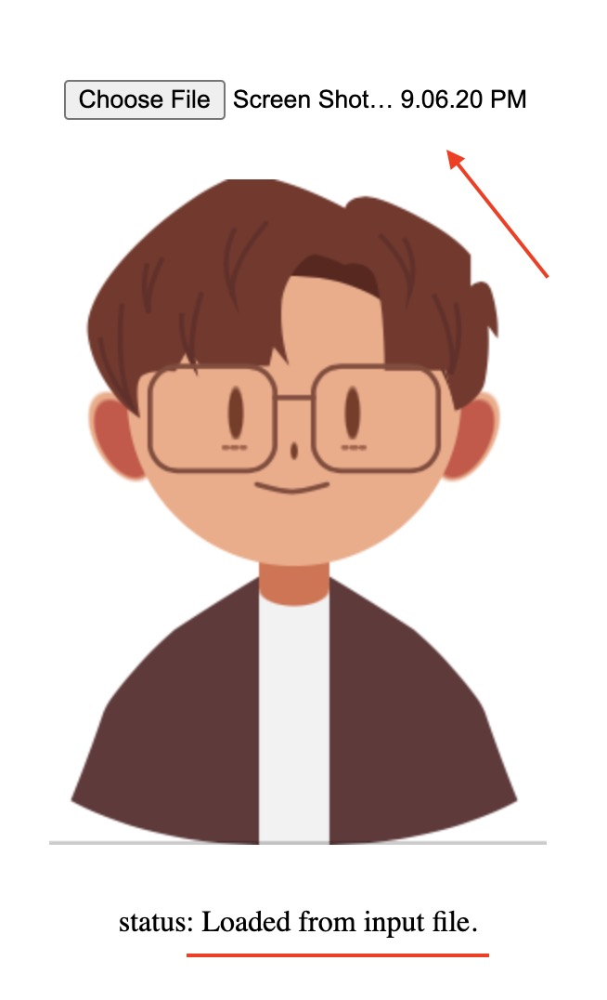
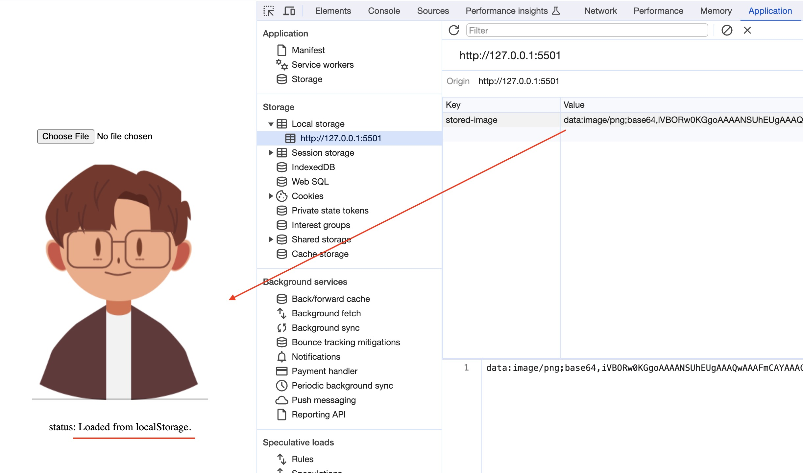
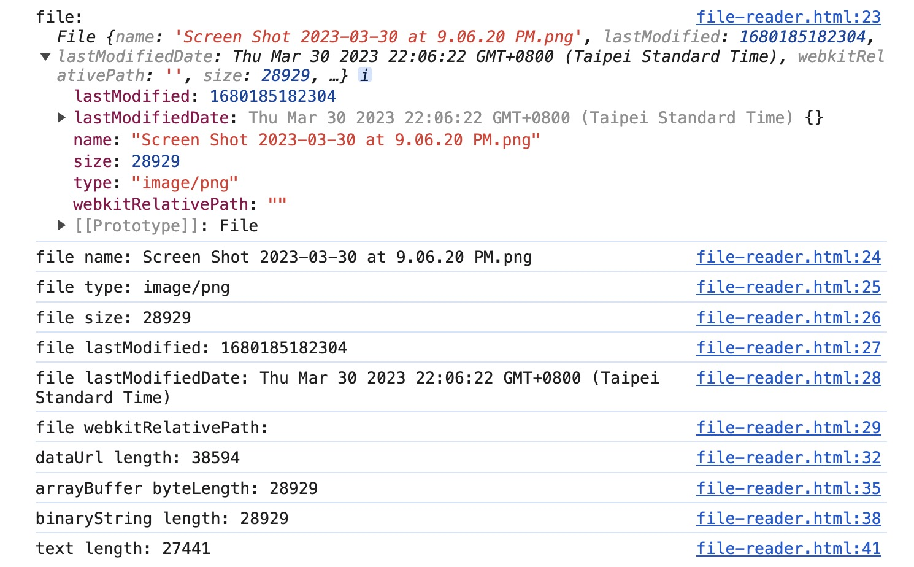

# Store Image file into localStorage

To store image file in client side environment, there are some storage options to handle it. This experiment use localStorage to store the image file as DataURL format.

[browser-storage.html](browser-storage.html) demostrate how to store image file into browser localStorage after choose a image file. And load image file from localStorage when initializing the page.

[file-reader.html](./file-reader.html) use FileReader API: readAsDataURL, readAsArrayBuffer, readAsBinaryString, readAsText to compare loaded file size in different format.

